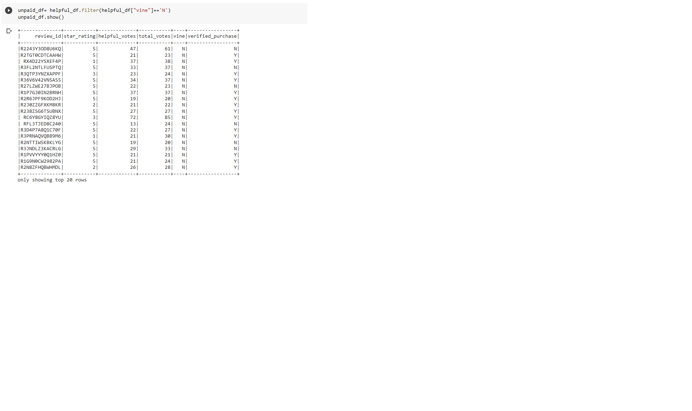
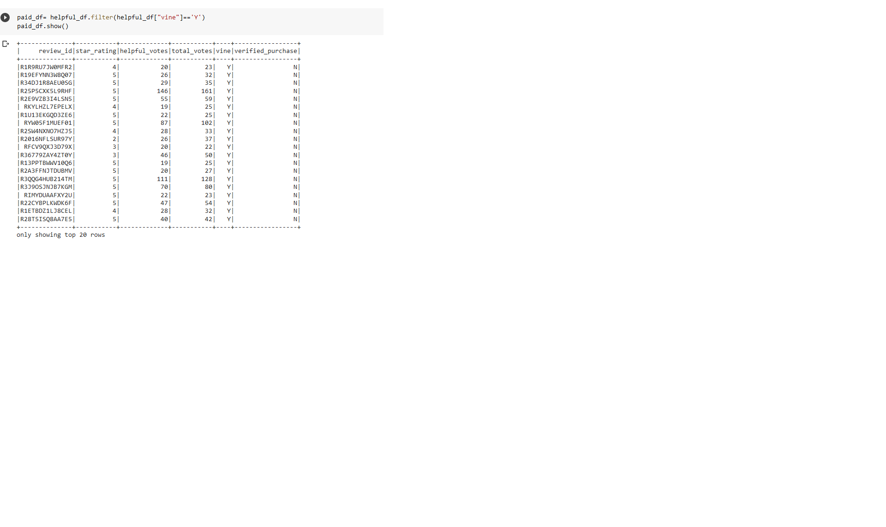

# Amazon_Vine_Analysis
## Overview
The goal of this analysis is to extract review content from the Amazon vine program and determine how the paid Vine reviews affect the likelihood of a product receiving a 5 star review. To this end we used PsySpark, AWS-RDS, and Postgres. We specifically looked at musical instrument reviews. 

## Results 
The original dataframe created from the Vine data was broken down into a table of Vine's paid reviews and a table of unpaid reviews. 

For the musical instrument reviews 
    *14,477 non-Vine reviews
    *60  Vine reviews
    *8,212 non-Vine 5 star reviews 
    *34 Vine 5 star reviews
    *Both categories show 5 star reviews at 57% 

## Summary
My analysis finds no bias in the Vine reviews but becaus vine reviews made up only less than 0.5% of all reviews that analysis could change quickly with any additional reviews. The matching 57% 5 star rating would with a more robust set of Vine reviews be a fairly hard proof for lack of bias. I would be interested in further developing this analyis by looking at the Vine reivews versus non Vine reviews for individual products. Do the Vine reviews cling to tthe product average or do they tend to be above or below. 

